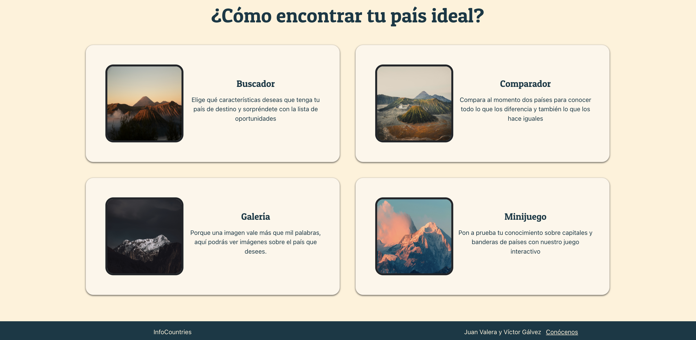
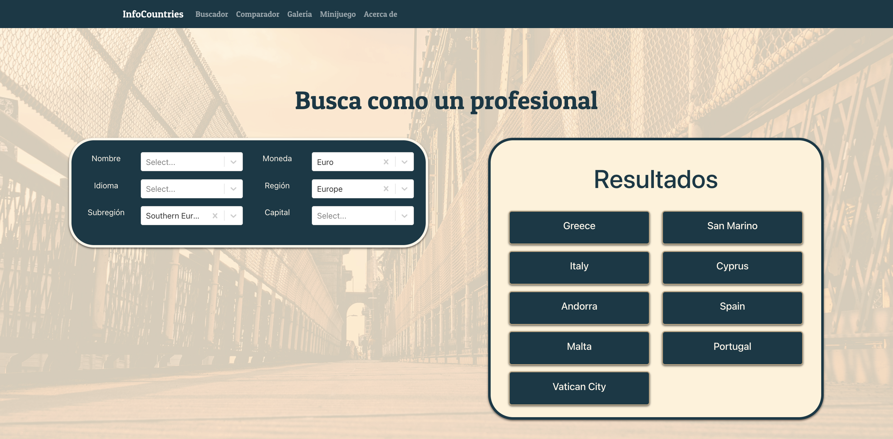
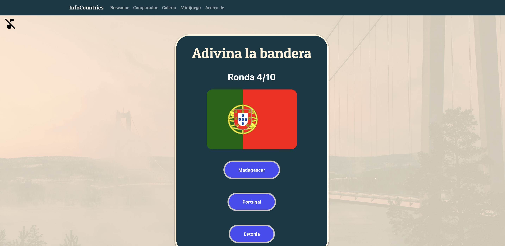

Esto es el parte del proyecto de fin de grado del curso DAM en el IES Ginés Pérez Chirinos, en 2024, realizado por Juan Valera y Víctor Gálvez.

Puedes acceder a la aplicación aquí: https://infocountrieswebservice.onrender.com/

Puedes encontrar la versión para móvil con React Native aquí: https://github.com/VictorGlvez/InfoCountriesReactNative

## Algunas capturas de la aplicación.

